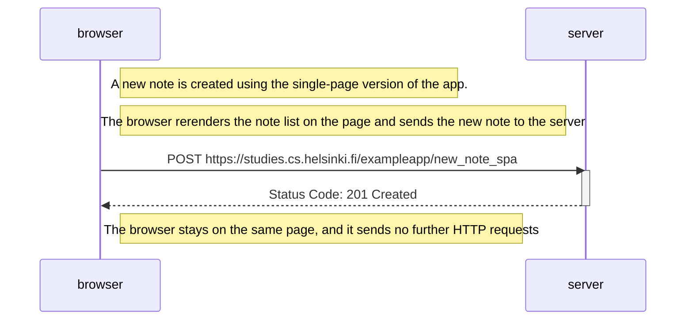

```mermaid

sequenceDiagram
    participant browser
    participant server

    Note right of browser: A new note is created using the single-page version of the app.
    Note right of browser: The browser rerenders the note list on the page and sends the new note to the server
    browser->>server: POST https://studies.cs.helsinki.fi/exampleapp/new_note_spa
    activate server
    server-->>browser: Status Code: 201 Created
    deactivate server
    Note right of browser:  The browser stays on the same page, and it sends no further HTTP requests


```
